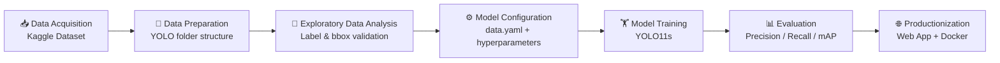
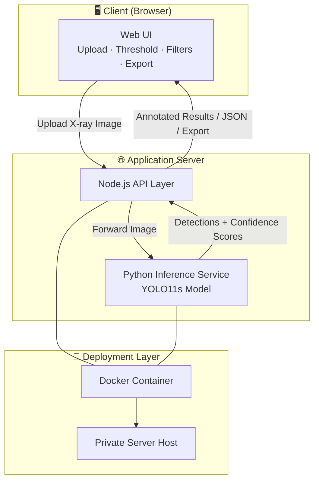
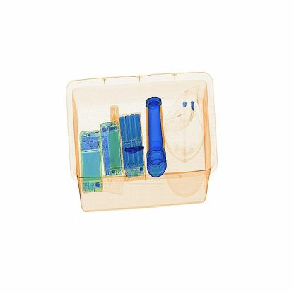
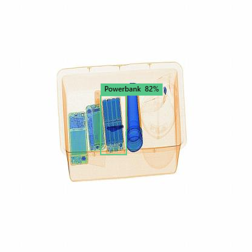
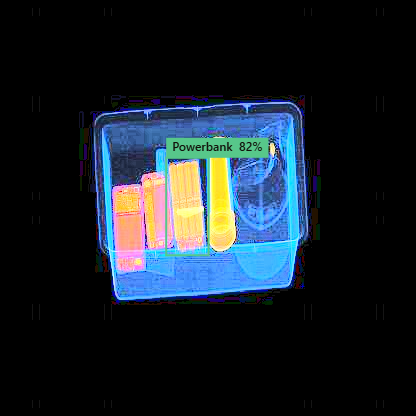

<div align="center">

# 🛡️ X-Guard AI
### Real-Time Threat Detection in Security X-ray Images Using YOLO11s

*Bridging the gap between academic accuracy and real-world security screening*

[](https://www.python.org/)
[](https://github.com/ultralytics/ultralytics)
[](https://hub.docker.com/)
[](https://nodejs.org/)
[](https://developer.mozilla.org/en-US/docs/Web/JavaScript)
[](#-license)
[](#)

</div>

---

## 📖 Table of Contents

1. [Overview](#-overview)
2. [Research Motivation](#-research-motivation)
3. [Dataset](#-dataset)
4. [Methodology](#-methodology)
5. [Model Comparison and Selection](#-model-comparison-and-selection)
6. [Performance Results](#-performance-results)
7. [Web Application](#-web-application)
8. [System Architecture](#-system-architecture)
9. [Docker Deployment](#-docker-deployment)
10. [Installation Guide](#-installation-guide)
11. [Running the Application](#-running-the-application)
12. [Docker Hub Repository](#-docker-hub-repository)
13. [Live Demo](#-live-demo)
14. [Screenshots](#-screenshots)
15. [Future Work](#-future-work)
16. [Disclaimer](#-disclaimer)
17. [License](#-license)
18. [Author](#-author)

---

## 🔍 Overview

**X-Guard AI** is an automated threat-object detection system for security X-ray screening, built on the **YOLO11s** object detection architecture. The system identifies **12 categories of prohibited items** in real time, helping security operators flag dangerous or restricted objects faster and more consistently than manual visual inspection alone.

**Detected threat categories:**

| 🔧 Tools & Blunt Objects | 🔪 Sharp Objects | 🔫 Weapons & Ammunition | 🔌 Other Prohibited Items |
|---|---|---|---|
| Baton, Pliers, Hammer, Wrench | Scissors, Knife | Gun, Bullet | Powerbank, Sprayer, HandCuffs, Lighter |

What started as an academic research notebook evolved into a **full-stack, containerized web application**, designed with real deployment and operator usability in mind — not just benchmark performance.

---

## 🎯 Research Motivation

Automated X-ray threat detection has been widely studied in computer vision research, yet the study underpinning this project identified a recurring **gap between research and practice**:

- 📊 Most existing solutions **optimize purely for benchmark accuracy** (mAP, precision, recall) on academic datasets.
- 🖥️ **Limited attention is given to deployment feasibility** — inference speed, resource footprint, and integration into an operator-facing workflow.
- 👮 **Security operator usability** (adjustable thresholds, filtering, visual clarity of results) is often an afterthought rather than a design requirement.

X-Guard AI was developed to directly address this gap: a model selection process that explicitly weighs **accuracy against real-time feasibility**, packaged into a **usable, deployable tool** rather than left as a standalone research artifact.

---

## 🗂️ Dataset

The project uses the **Balanced X-ray Contraband Detection Dataset**, sourced from Kaggle and derived from two well-known public X-ray security datasets: **SIXray** and **PIDray**.

| Attribute | Detail |
|---|---|
| 🖼️ Total Images | 13,728 |
| 🏷️ Annotation Format | YOLO format (`.txt`) |
| 📦 Contraband Classes | 12 |
| ⚖️ Class Distribution | Balanced across classes |
| 🗃️ Config Files | 2 YAML (`data.yaml`) |
| 📁 Image Format | JPG |

**Class list:**

| ID | Class | ID | Class |
|:--:|---|:--:|---|
| 0 | Baton | 6 | Gun |
| 1 | Pliers | 7 | Bullet |
| 2 | Hammer | 8 | Sprayer |
| 3 | Powerbank | 9 | HandCuffs |
| 4 | Scissors | 10 | Knife |
| 5 | Wrench | 11 | Lighter |

The dataset was organized into the standard Ultralytics YOLO folder structure prior to training:

```text
data/
├── images/
│   ├── train/
│   ├── val/
│   └── test/
├── labels/
│   ├── train/
│   ├── val/
│   └── test/
└── data.yaml
```
## 📂 Repository Structure

```text
em08ds_xod_project/
│
├── xod/                      # Research notebooks, training scripts, and YOLO11s experiments
│
├── XOD_WebApp/               # Production web application
│   ├── backend/              # Python API and AI inference services
│   ├── frontend/             # JavaScript user interface
│   ├── models/               # Trained YOLO11s model weights
│   └── assets/               # Static resources and application assets
│
├── docs/                     # Project documentation
│   ├── screenshots/          # Web application screenshots
│   ├── diagrams/             # Architecture and workflow diagrams
│   ├── reports/              # Research reports and papers
│   └── deployment/           # Docker and deployment guides
│
├── README.md                 # Project overview and documentation
├── requirements.txt          # Python dependencies
├── Dockerfile                # Docker image definition
└── LICENSE                   # Open-source license

> 🎯 **Class balancing** was applied specifically to reduce bias toward over-represented items (e.g., common tools) and improve detection reliability for rarer, higher-risk items (e.g., firearms, ammunition).

---

## 🧪 Methodology

The project followed a structured research-to-production pipeline:



**Key steps:**

1. **Data Acquisition** — Dataset imported from Kaggle into the training environment.
2. **Data Preparation** — Images and YOLO-format labels split into `train` / `val` / `test`, restructured into the Ultralytics-required directory layout.
3. **Exploratory Data Analysis (EDA)** — Sample images and bounding-box annotations visually inspected across all splits to confirm label accuracy and alignment.
4. **Model Configuration** — A `data.yaml` file was defined specifying dataset paths, number of classes (`nc: 12`), and class names.
5. **Training** — YOLO11s was fine-tuned using:
   - Image size: **640×640**
   - Batch size: **16**
   - Optimizer: **AdamW**
   - Initial learning rate: **0.001**, final learning rate factor: **0.0001**
   - Early stopping patience configured to avoid overfitting
   - Training performed on a **GPU (Tesla T4)**
6. **Evaluation** — Model validated on a held-out test split using standard object detection metrics (Precision, Recall, F1-score, mAP@50, mAP@50-95) plus a normalized confusion matrix.
7. **Interpretation** — Training/validation loss and mAP curves analyzed across epochs to confirm stable convergence with mild, monitored overfitting in later epochs.
8. **Productionization** — The validated model was wrapped into a full web application and containerized for deployment.

---

## ⚖️ Model Comparison and Selection

During the research phase, multiple object detection models were evaluated against four criteria:

| Criterion | Description |
|---|---|
| 🎯 Detection Accuracy | mAP, precision, recall on the contraband dataset |
| ⚡ Inference Speed | Real-time feasibility for screening throughput |
| 💻 Computational Efficiency | Resource requirements (VRAM, compute) |
| 🚀 Deployment Feasibility | Ease of integration into a production web/edge system |

**Why YOLO11s?**

YOLO11s was selected over larger variants (`m`, `l`, `x`) and the nano variant (`n`) because it offers the strongest **overall balance**:

- ✅ Significantly lighter and faster than medium/large/extra-large YOLO11 variants, enabling **real-time inference**.
- ✅ Higher representational capacity than the nano variant, translating into **better detection accuracy** on complex, cluttered X-ray imagery.
- ✅ Efficient enough for **practical deployment** in web-based and edge-AI security screening systems, without requiring specialized high-end hardware.

This made YOLO11s the most suitable candidate for a system intended to run in operational, latency-sensitive environments rather than purely offline research pipelines.

---

## 📈 Performance Results

Final evaluation was performed on the held-out **test split** of the Balanced X-ray Contraband Detection Dataset.

<div align="center">

| Metric | Score |
|:---|:---:|
| 🎯 **Precision** | **93.28%** |
| 🔁 **Recall** | **87.05%** |
| 📊 **mAP@50** | **93.11%** |
| 📉 **mAP@50-95** | **76.66%** |

</div>

**Interpretation:**

- The high **Precision (93.28%)** indicates a low false-positive rate — the model rarely flags benign objects as threats.
- **Recall (87.05%)** shows strong detection coverage of true threat items, with room for improvement on harder/occluded cases.
- **mAP@50 (93.11%)** confirms robust detection performance under standard IoU thresholds.
- **mAP@50-95 (76.66%)** reflects solid localization quality across stricter IoU thresholds, typical of the added difficulty of X-ray imagery (overlapping, translucent objects).

Training and validation loss curves showed **stable convergence**, with box, classification, and DFL losses decreasing consistently across training epochs, and a mild, monitored divergence between train/validation loss in later epochs.

> 📌 *Confusion matrices, loss curves, and per-class performance plots generated during evaluation are available in the accompanying research notebook.*

---

## 🌐 Web Application

To move beyond a notebook-only research artifact, X-Guard AI was rebuilt as an **operator-facing web application**.

**Core features:**

- 📤 **Upload X-ray Images** — Drag-and-drop or file-browser image upload
- ⚡ **Real-Time Threat Detection** — Instant inference and bounding-box visualization
- 🎚️ **Confidence Threshold Adjustment** — Operators can tune sensitivity on the fly
- 🏷️ **Threat Class Filtering** — Focus results on specific contraband categories
- 🖼️ **Image Enhancement Tools** — Improve visibility of low-contrast or cluttered scans
- 📄 **Export Detection Results** — Save/download annotated results and reports
- 🧑‍✈️ **Operator-Friendly Interface** — Designed for fast, low-friction screening workflows

**Technology stack:**

| Layer | Technology |
|---|---|
| 🧠 Detection Model | YOLO11s (Python / Ultralytics) |
| 🔙 Backend | Python, Node.js |
| 🖥️ Frontend | JavaScript |
| 📦 Deployment | Docker |

---

## 🏗️ System Architecture



**Flow summary:**

1. The operator uploads an X-ray image through the web UI.
2. The Node.js API layer receives the image and forwards it to the Python inference service.
3. The YOLO11s model runs detection and returns bounding boxes, class labels, and confidence scores.
4. Results are rendered back in the UI with filtering, thresholding, and export options.
5. The entire stack runs inside a single Docker container, deployable to any Docker-compatible host.

---

## 🐳 Docker Deployment

The application is fully **containerized with Docker** to solve dependency management and library compatibility issues encountered across different environments (Python ML dependencies, Node.js runtime, system-level libraries for image processing).

**Why Docker?**

- 🔒 Guarantees a **consistent runtime environment** across machines
- 📦 Bundles Python (YOLO11s + inference dependencies) and Node.js (API/frontend) into a single deployable unit
- 🚀 Simplifies deployment to any private server or cloud host supporting containers
- 🔁 Enables reproducible builds and easier version rollbacks

---

## ⚙️ Installation Guide

### Prerequisites

- [Docker](https://docs.docker.com/get-docker/) installed and running
- *(Optional, for local/non-Docker development)*: Python 3.9+, Node.js 18+, pip, npm

### Option A — Run with Docker 

```bash
# 1. Pull the image from Docker Hub
docker pull magdykeshta/xod-webapp

# 2. Run the container
docker run -d -p 5000:5000 --name xod-webapp magdykeshta/xod-webapp
```

### Option B — Build from Source

```bash
# 1. Clone the repository
git clone https://github.com/Magdy-Keshta/em08ds_xod_project.git
cd XOD_WebApp

# 2. Build the Docker image locally
docker compose build .

# 3. Run the container
docker run -d -p 5000:5000 --name xod-webapp  xod-webapp 
```

### Option C — Manual Local Setup (Development)

```bash
# 1. Open the URL (Recommended)
http://80.241.217.101:5000/
```


### Option D — Explore the Research Notebook

To review the original model training, EDA, and evaluation process, run the notebook in **Colab** rather than opening it as a static file:

```bash
# Just Open Colab and upload the Notebook after cloning this repository 

```

Then open `X_Guard_AI_Real_Time_Edge_Threat_Detection_in_Security_X_ray_Images_Using_YOLOv.ipynb` from the Colab file browser.

> 💡 Running it in Colab (instead of just previewing on GitHub) lets you re-execute cells, inspect the confusion matrix/loss plots interactively, however its not recommended to re-run training .  

---

## ▶️ Running the Application

Once the container (or local server) is running:

1. Open your browser and navigate to:
   ```
   http://localhost:8080
   ```
2. Upload an X-ray image using the **Upload** panel.
3. Adjust the **confidence threshold** slider to control detection sensitivity.
4. Use **class filters** to isolate specific threat categories (e.g., only Guns/Knives).
5. Review detected objects with bounding boxes and confidence scores.
6. **Export** the annotated results for reporting or record-keeping.

---

## 🐋 Docker Hub Repository

The pre-built Docker image is published and available on Docker Hub:

🔗 **[Docker Hub — xod-webapp](https://hub.docker.com/repository/docker/magdykeshta/xod-webapp)**

```bash
docker pull magdykeshta/xod-webapp:v1
```

---

## 🚀 Live Demo

The application is hosted on a private server for demonstration purposes.

🔗 **Live Demo:** `http://80.241.217.101:5000/`

> 🔐 Access may be restricted. Contact the author for a demo walkthrough or credentials.

---

## 🖼️ Screenshots

> 📸 *Add screenshots of the web application below to showcase the upload flow, detection results, and export features.*

| Upload Interface | Detection Results | Threshold & Filtering |
|:---:|:---:|:---:|
|  |  |  |

---

## 🔮 Future Work

- 🧠 Experiment with larger YOLO11 variants (`m`/`l`) and knowledge distillation to boost recall without sacrificing real-time speed
- 🩻 Extend the dataset with additional real-world scanner imagery to improve generalization beyond SIXray/PIDray distributions
- 📱 Add edge-device deployment (e.g., NVIDIA Jetson) for on-site, offline screening
- 🔔 Integrate real-time alerting/notification pipeline for security control rooms
- 📊 Add a model performance dashboard for ongoing monitoring in production
- 🧾 Support batch/video-stream processing for conveyor-belt style continuous scanning
- 🔒 Add role-based access control and audit logging for operator actions

---

## ⚠️ Disclaimer

This project is developed for **academic and research purposes**. It is a **prototype system** and is **not certified for deployment in live security or aviation screening environments** without further validation, regulatory approval, and integration testing.

Detection results should **not be treated as a sole decision-making authority** — the system is intended to **assist**, not replace, trained human security operators. The authors assume no liability for outcomes resulting from real-world use of this software outside of a research or evaluation context.

---

## 📄 License

This project is licensed under the **MIT License** — see the [LICENSE](LICENSE) file for details.

---

## 👤 Author

**X-Guard AI** was developed as an academic research project, transitioned into a full-stack, production-oriented application.

- 💻 GitHub: `magdykeshta`
- 📧 Contact: `magdy.keshta@gmail.com`
- 🎓 Institution: Emirates Aviation University

<div align="center">

---

⭐ **If you find this project useful, consider starring the repository!** ⭐

</div>
